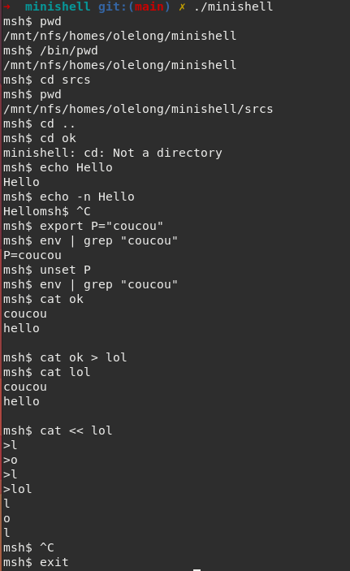

# 42_minishell
Developing a shell

Project in pair with @afaure.

<p align="left"> *************************** ENGLISH *************************** </p>

## The Project :
The goal of this program is to implement a shell as close to bash as possible.  
But also to use the interactive and non-interactive signals  
such as ``` ctrl + c ``` , ``` ctrl + d ``` and ``` ctrl + \ ```.

## How does it works :
Clone the repository ``` git clone git@github.com:olelong/42_minishell.git ```  
Enter in the repository ``` cd 42_minishell ``` or the name you gave when you cloned the repository  
  
### To launch the program you can :
Type the command ``` make ```
Launch the executable ``` ./minishell ```

Then you can run shell commands such as :  
◦ ```echo ``` and the -n option  
◦ ```cd ``` only with a relative or absolute path  
◦ ``` pwd ``` without any options  
◦ ``` export ``` without any option  
◦ ``` unset ``` without any option  
◦ ``` env ``` without any option or argument  
◦ ``` exit ``` without any option  
◦ ``` echo $? ```  

You can play with redirects:
◦ ``` < ``` must redirect the input.  
◦ ``` > ``` must redirect the output.  
◦ ``` << ``` must receive a delimiter and read the given input until  
it encounters a line containing the delimiter. However, the history  
does not have to be updated!  
◦ ``` >> ```must redirect the output to append mode  
and the ``` | ``` pipes.  
  
### Some examples of commands :

   
<p align="left"> *************************** FRANCAIS *************************** </p>

## Le Projet :
Le but de ce programme est d'implémenter un shell aussi proche de bash que possible.  
Mais aussi d'utiliser les signaux interactifs et non-interactifs  
tels que ``` ctrl + c ``` , ``` ctrl + d ``` et ``` ctrl + \ ```.  

## Comment ça marche :  
Clonez le repository ``` git clone git@github.com:olelong/42_minishell.git ```  
Entrez dans le dossier ``` cd minishell ``` ou le nom que vous avez donné lorsque vous avez cloné le repo
  
### Pour lancer le programme, vous pouvez :
Taper la commande ``` make ```  
Lancer l'exécutable ``` ./minishell ```  

Vous pouvez ensuite exécuter des commandes shell telles que :  
◦ ``` echo ``` et l'option -n.  
◦ ``` cd ``` uniquement avec un chemin relatif ou absolu  
◦ ``` pwd ``` sans aucune option  
◦ ``` export ``` sans aucune option  
◦ ``` unset ``` sans aucune option  
◦ ``` env ``` sans option ni argument  
◦ ``` exit ``` sans aucune option  
◦ ``` echo $? ```  
  
Vous pouvez jouer avec les redirections :  
◦ ``` < ``` doit rediriger l'entrée.  
◦ ``` > ``` doit rediriger la sortie.  
◦ ``` << ``` doit recevoir un délimiteur et lire l'entrée donnée jusqu'à ce que  
qu'il rencontre une ligne contenant le délimiteur. Cependant, l'historique  
ne doit pas être mis à jour !  
◦ ``` >> ``` doit rediriger la sortie vers le mode append.  
et les ``` | ``` pipe.  

### Some examples of commands :

